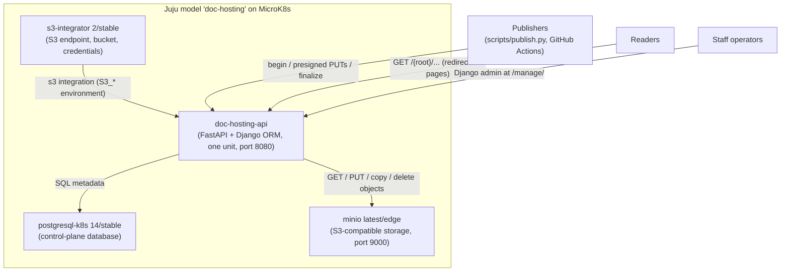

# doc-hosting deployment design

This document explains the deployment this repository represents: what runs
where, how data flows through it, how it is secured and operated, and which
trade-offs were accepted. It is written for engineers who need an accurate
mental model of the system before changing, operating, or extending it.

## Purpose, scope, and status

`doc-hosting` is a proof of concept (PoC) for publishing and serving static
documentation from S3-compatible storage, orchestrated by Juju on a local
Kubernetes cluster. A FastAPI application exposes the publication and version
APIs and serves published pages; a Django ORM control plane backed by
PostgreSQL holds the metadata; an S3 bucket holds the published files.

Scope of this document:

- **Facts** describe what this repository actually implements and deploys.
  They are grounded in the application code (`doc_hosting/`), the charm and
  rock definitions (`charm/`, `rockcraft.yaml`), the deployment automation
  (`scripts/deploy.py`), the publisher (`scripts/publish.py`), the tests, and
  the in-tree documentation.
- **Recommendations** describe provider-neutral practice for areas the PoC
  deliberately leaves open (backup, TLS, scaling, observability). They are
  clearly labeled and are *not* properties of the current deployment. Nothing
  in this document invents infrastructure facts: where the repository is
  silent, the gap is stated as a gap.

Status: proof of concept. The local deployment is disposable by design; its
teardown destroys the model and its storage. It is not production-ready (see
[Trade-offs and limitations](#trade-offs-and-limitations)).

## Overview

The system separates a small **control plane** (PostgreSQL: projects,
publications, upload sessions, redirects, operations, audit) from a large
**content plane** (S3: static files). The application is the only component
that talks to both: it authorizes uploads, verifies them, registers metadata,
and serves bytes.

Readers reach the API directly in this PoC. The in-tree use-case documentation
describes a content cache placed in front of the API as an *assumed* topology,
not a deployed one; the application sends no cache directives and offers no
cache-invalidation interface.

## Current runtime and deployment (facts)

### Orchestration and cluster

- **Juju** client from the `3.6/stable` snap channel; controller
  `doc-hosting-controller` bootstrapped on MicroK8s.
- **MicroK8s** from the `1.34-strict/stable` channel, single-node, with the
  `hostpath-storage`, `registry`, and `dns` addons enabled; LXD is installed
  for the artifact builders. Setup refuses an existing cluster on any other
  Kubernetes minor rather than upgrading it.
- One Juju model: `doc-hosting`.

### Applications in the model

| Application | Channel / source | Role |
| --- | --- | --- |
| `doc-hosting-api` | local charm + local rock resource | Publication/version API, doc serving, Django admin |
| `postgresql-k8s` | `14/stable` | Control-plane PostgreSQL via the `postgresql` integration |
| `minio` | `latest/edge` | S3-compatible content storage (port 9000) |
| `s3-integrator` | `2/stable` | Supplies endpoint, bucket, credentials via the `s3` integration |

The `s3-integrator` charm (track 2) holds the MinIO credentials in a Juju
secret referenced by its `credentials` config option, is pointed at the
in-cluster MinIO endpoint and the `doc-hosting` bucket, and creates the
bucket in the backend when it does not exist.

### The application charm and its rock

- The charm is a **12-factor charm** built on the PAAS charm framework: the
  `fastapi-framework` charmcraft extension, with `paas_charm.fastapi.Charm`
  as its base. It requires exactly one `s3` integration and one `postgresql`
  integration (both blocking when absent).
- The application runs as a **chiselled rock**: `rockcraft.yaml` uses a bare
  base with an Ubuntu 24.04 build base, `amd64` platform, and the
  `fastapi-framework` rockcraft extension. The rock contains the ASGI
  entrypoint (`app.py`), the Django management entrypoint (`manage.py`), and
  the `doc_hosting` package over a pinned `requirements.txt` exported with
  `uv export --frozen`.
- `scripts/deploy.py build` pushes the packed rock to the MicroK8s local
  container registry (`localhost:32000/doc-hosting-api:0.1`) and packs the
  charm; the deployment attaches it as the `app-image` charm resource.
- The deployment talks to the API on **port 8080**; a single unit is
  deployed. The charm runs `manage.py migrate` before the service starts, and
  the application provisions the Django admin superuser at startup from the
  `admin-username` / `admin-password` charm config options (defaults
  `admin`/`admin`; creation-only, so a password changed in the admin
  interface survives restarts).

### Charm configuration

| Option | Requirement | Effect |
| --- | --- | --- |
| `publish-token` | Required | Deployment-wide bearer token, exposed as `APP_PUBLISH_TOKEN` |
| `allowed-hosts` | Optional | Django `ALLOWED_HOSTS` (`APP_ALLOWED_HOSTS`) |
| `csrf-trusted-origins` | Optional | Django CSRF origins (`APP_CSRF_TRUSTED_ORIGINS`) |
| `admin-username` | Optional (default `admin`) | Superuser username (`APP_ADMIN_USERNAME`) |
| `admin-password` | Optional (default `admin`) | Initial superuser password (`APP_ADMIN_PASSWORD`) |

### Deployment lifecycle

`scripts/deploy.py` provides the lifecycle (`all` = setup -> build ->
deploy):

- **setup** — installs the snaps (juju, microk8s, lxd, rockcraft,
  charmcraft), initializes LXD when needed, enables and health-checks the
  MicroK8s addons, verifies the default storage class, and bootstraps the
  Juju controller. Idempotent.
- **build** — exports requirements, packs the rock, pushes it to the local
  registry, packs the charm.
- **deploy** — creates the model, deploys MinIO with generated credentials,
  deploys and configures `s3-integrator` (endpoint, bucket, Juju secret),
  deploys `postgresql-k8s`, deploys or refreshes the API charm, wires both
  integrations, configures the publish token, waits for all four
  applications to become active, and writes the connection details
  (including a generated project secret) to `.juju-deploy.env`.
- **teardown** — destroys the model and its storage; with `--controller`
  also the controller, including recovery of a verified orphaned controller
  namespace.

### Automation around the deployment

- **CI** (`.github/workflows/test.yaml`) runs the unit suite against a
  `postgres:16` service container via `POSTGRESQL_DB_CONNECT_STRING`, plus a
  charm/rock artifact-build job.
- **Artifact publishing** (`publish-edge.yaml`) releases the built artifacts
  through the charm-ci reusable publishing workflow.
- **Publish workflow** (`publish-docs.yaml`) runs on manual dispatch: it
  builds the Sphinx docs and runs `scripts/publish.py` against the deployed
  API using repository variables/secrets for the API URL, domain, token, and
  project secret. No S3 credentials are exposed to the workflow.
- **Documentation checks** (`automatic-doc-checks.yml`) run the standard
  documentation checks (build, spelling, inclusive language, link checking).
- **Read the Docs** (`.readthedocs.yaml`) builds the Sphinx documentation on
  Ubuntu 24.04 with Python 3.12 and the `docs` dependency group, with
  warnings treated as errors.

## Storage (facts)

- One bucket: `doc-hosting` (the name configured into `s3-integrator`;
  deployment tooling verifies it exists and creates it as a safety net).
- **Object keys mirror served URLs.** For a project with both dimensions
  enabled, content lives under `{root}/{language}/{version}/...`; the three
  other layouts drop the disabled dimension segments. Serving therefore needs
  no key database: a URL is translated to a key by the project's layout
  flags alone.
- An optional `S3_PATH` prefix (from the `s3` integration) is prepended to
  every application key, invisible to URL logic.
- Published content is a plain static tree (the repository's own docs are
  Sphinx `dirhtml` output). The publisher computes each file's relative
  path, size, and SHA-256 at publish time, so a registered publication is
  exactly the bytes the publisher had on disk, verified end to end.
- The reserved `_registry/` prefix holds **legacy registry JSON**
  (`_registry/{root}.json`). It is a read-only import input: the importer
  reads it and never writes it, serving rejects reserved top-level segments
  (`api`, `manage`, `health`, `_registry`), and root paths may not use them.
- The application needs broad bucket access (GET, PUT, copy, delete, list)
  because serving, verified uploads, layout re-keying, and root migrations
  all operate on the same bucket.

## Control plane: PostgreSQL (facts)

Django defines seven models (see `doc_hosting/registry/models.py`):

| Model | Purpose |
| --- | --- |
| `Project` | Claimed normalized root: domain, hashed project secret, layout flags and disabled-dimension labels |
| `Publication` | Current build per (project, language, version); upserted on every publish |
| `UploadSession` | Direct-upload session: manifest, key prefix, expiry, `pending`/`completed` |
| `Redirect` | Exact/prefix same-site redirect with enabled flag |
| `PathMigration` | Root-migration state machine with the copied-key mapping |
| `LayoutChange` | Layout-toggle state machine with the re-keying map and created redirect IDs |
| `AuditEvent` | Append-only history of every control-plane mutation |

- Migrations are applied at process startup, guarded by a PostgreSQL
  **session advisory lock** so concurrent workers cannot double-apply
  migrations or race the admin provisioning.
- Ownership boundary checks (root claims, root-migration switches) are
  serialized with a PostgreSQL **transaction-scoped advisory lock**.
- **SQLite is a development/test fallback only** (via
  `POSTGRESQL_DB_CONNECT_STRING` / `DATABASE_URL` / `DOC_HOSTING_SQLITE_PATH`);
  the concurrency guarantees above are PostgreSQL-specific, and the
  PostgreSQL-only concurrency test skips under SQLite.

## Content model (facts)

- A **project** owns a normalized, possibly nested root path (trimmed,
  lowercased, repeated slashes collapsed; matched strictly on segment
  boundaries, so `project-1` does not own `project-10`).
- A **publication** is the current build for one (project, language,
  version) triple. Publishing again for the same triple replaces the row;
  other triples coexist. There is no per-build history in the control plane
  beyond the audit trail, and no versioned copies in storage beyond the
  current tree per triple.
- Each project selects one of **four URL layouts** — language+version,
  language only, version only, root only — via its dimension flags.
- **Redirects** are same-site absolute paths, exact or segment-boundary
  prefix, with loop/hop protections (chains resolve within 10 hops, 508
  beyond), reserved-namespace and registered-root-shadow protections, and an
  in-process resolution cache (default TTL 30 s, explicit invalidation on
  mutations).
- **Root migrations** and **layout changes** are resumable state machines
  (`pending` -> `switched` -> `completed`) that copy objects, switch
  metadata transactionally, install validated old-to-new redirects, and
  delete exactly the copied keys. Layout toggles that enable a disabled
  dimension require recorded key lineage proving every object belongs to a
  publication.

## Data flows (facts)

### Publication (the only registration path)

1. **Begin** (`POST /api/v1/uploads`): the caller presents the deployment
   bearer token and the project secret plus a file manifest (path, SHA-256,
   size per file). The API normalizes and validates the manifest, claims the
   root on first use (or authenticates an existing claim), enforces the
   project's dimension rules, records a pending `UploadSession`, and returns
   one short-lived **exact-key presigned PUT URL per file**, each signed with
   the file's SHA-256 checksum.
2. **Upload**: the publisher PUTs each file to its URL with the returned
   checksum header; the storage itself rejects a body that does not match the
   signed checksum. The publisher never holds S3 credentials.
3. **Finalize** (`POST /api/v1/uploads/{upload_id}/finalize`): the API
   re-authenticates, rejects expired sessions and manifest drift, re-asserts
   the current dimensions, and verifies every object's existence, size, and
   stored SHA-256 (falling back to hashing the bytes when the storage
   reports no stored checksum). Only then does one transaction upsert the
   publication, complete the session, and append audit events. Failures
   leave the session pending and retryable until expiry; replaying a
   completed session with the identical manifest is idempotent.

The supported publication API has no register-only path: it creates a
publication only after verifying the uploaded objects. The legacy importer is
the deliberate exception; it can reconstruct publication metadata from
existing ``_registry`` records without re-verifying the referenced objects.

### Serving

A reader request first resolves enabled redirects (301 to the final target,
508 on loops/overlong chains), then matches the longest registered root,
parses the remainder against that project's layout, and fetches the object
from S3 — trying the exact key and then `<path>/index.html`. Layout roots
without a trailing slash get a 307. Media types are inferred from
filenames. Unknown, incomplete, unclaimed, and traversal paths return 404
without exposing internal S3 keys.

### Versions

`GET /api/v1/versions?root_path=...` is public and unauthenticated: it
returns the normalized root, domain, grouped versions with sorted languages
and the latest matching commit hash, and the active layout flags.

### Management

Staff operators use the Django admin at `/manage/` (staff-only login, CSRF
enforced) to inspect projects and publications, rotate project secrets
through a write-only field, manage redirects through the validating
services, and drive/resume root migrations and layout changes. Audit events
are read-only there.

### Legacy import

`manage.py import_legacy_registry` reads the `_registry/*.json` objects
once (idempotently, without writing to the bucket), validates labels, and
upserts projects and publications. Imported projects have no secret; the
first fully authenticated upload adopts one.

## Security (facts)

- **Two independent credentials gate every publication**: the
  deployment-wide bearer token (`Authorization: Bearer <APP_PUBLISH_TOKEN>`,
  compared with a constant-time comparison) and the per-root project secret
  in the JSON body. Only the project secret is stored, as a salted,
  irreversible hash (Django PBKDF2 format). The bearer token never becomes
  project state.
- **Uploads are least-privilege by construction**: the publisher receives
  short-lived (default 900 s) exact-key presigned URLs bound to declared
  checksums; sessions expire on the same TTL. The API's own S3 credentials
  stay server-side.
- **Fail-closed application settings**: outside explicit development mode
  the process fails without a Django signing key, and with no configured
  allowed hosts Django trusts no host (the admin is unusable until
  configured, not wide open).
- **The admin is staff-only and CSRF-protected**, with publication/project
  creation and audit mutation disabled in the interface.
- **Audit events never contain secrets**, and error responses never echo
  either credential or internal S3 keys (enforced by tests).
- **Known exposure trade-offs of the PoC**: the charm's `publish-token` and
  `admin-password` are plain Juju config values visible to authorized Juju
  operators (the admin password only matters until first login); the local
  deployment is plain HTTP; `.juju-deploy.env` holds live credentials and
  must be protected and deleted after use.
- Because the register-only publication endpoint was **removed**, every
  publication created through the supported API is backed by storage objects
  that were checksum-verified at finalize time. Legacy imports remain a
  separate migration path and do not provide that guarantee.

## Operations, configuration, health, tests, docs (facts)

- **Health**: `GET /health` returns `{"status": "ok"}` and requires no
  configuration. It is a liveness check; it does not establish readiness of
  PostgreSQL or S3.
- **Configuration** is 12-factor environment variables injected by the
  charm: the S3 settings from the `s3` integration, `APP_PUBLISH_TOKEN` from
  the charm config, the PostgreSQL connection from the `postgresql`
  integration, plus optional TTLs (`DOC_HOSTING_UPLOAD_URL_TTL` for
  presigned URLs and sessions, `DOC_HOSTING_REDIRECT_CACHE_TTL` for the
  redirect cache).
- **Tests**: `uv run pytest tests/unit -v` runs the unit suite (SQLite
  fallback locally; PostgreSQL in CI, which also exercises the advisory-lock
  concurrency test). `uv run pytest tests/integration -v -m integration`
  deploys the full stack on Juju/MicroK8s and exercises publish-and-serve,
  credentials, the version API, and the admin; it requires the local
  cluster and built artifacts.
- **Documentation**: build with
  `uv run --group docs sphinx-build --fail-on-warning --keep-going -b dirhtml docs docs/_build`;
  warnings are errors. The docs cover deployment, publishing, management,
  testing, and reference material (API, configuration, components, storage
  model, use cases).
- **Recovery tools in-tree**: root migrations and layout changes are
  resumable state machines, and finalize retries are safe (idempotent
  replays, pending sessions), so transient storage failures have defined
  recovery paths. There is, however, **no backup or restore mechanism in this
  repository** — see the recommendations below.

## Provider-neutral recommendations

These are recommendations, not current properties of the deployment. The PoC
has no backup, no TLS, no HA, and no monitoring configured; anything below
would be new work.

### Backup, recovery, and durability

- **Control plane**: schedule regular logical backups of PostgreSQL
  (`pg_dump` at a minimum) and, for point-in-time recovery, enable WAL
  archiving or use a managed database service with PITR. The control plane is
  small but authoritative: losing it orphans every published object, since
  keys are only interpretable through project roots and layout flags.
- **Content plane**: enable **bucket versioning** so overwrites and deletes
  (including the delete phases of layout changes and root migrations) are
  recoverable, with a lifecycle policy for retention. Consider replication
  to a second bucket or region for durability.
- **Restore drills**: practice restoring the database and a bucket prefix
  together, and keep the export of the connection details
  (`.juju-deploy.env`) in a password manager, not on disk.
- **Rotation**: rotate the publish token and project secrets on a schedule;
  both are replaceable without data loss (the token via charm config, the
  project secret via the admin's write-only rotation field).

### Scaling and traffic

- Put a **CDN or caching reverse proxy** in front of serving traffic (the
  use-case documentation already assumes this topology) and keep
  publication/management traffic off the cache. Because the application
  emits no cache directives, freshness and invalidation must be policies of
  that cache layer.
- The charm supports running **multiple API units**; do so behind an ingress
  for availability, noting that redirect changes converge across processes
  within the redirect-cache TTL (default 30 s) and that S3 and PostgreSQL
  then carry the shared state.
- For larger deployments, prefer **managed services** for PostgreSQL and
  S3-compatible storage with their own HA, rather than single-instance
  MinIO and `postgresql-k8s` on a single node.

### TLS, availability, and observability

- Terminate **TLS at an ingress** in front of the API, then configure the
  charm's `allowed-hosts` and `csrf-trusted-origins` for the public origin
  before exposing the admin. Do not expose the plain-HTTP local deployment.
- Add **observability** the PoC lacks: structured request logs, metrics for
  request rates/latency and upload-session outcomes, and alerts on the
  health endpoint. The Juju ecosystem offers logging, metrics, and tracing
  integrations that a production variant of this charm could adopt.
- Treat the audit trail as an operational signal: it is the only history of
  claims, publications, redirects, and operations.

## Trade-offs and limitations

- **PoC infrastructure**: single-node MicroK8s with hostpath storage, a local
  container registry, `minio latest/edge`, plain HTTP, one API unit, no
  backups, no TLS, no monitoring. `teardown` destroys the model *and its
  storage*.
- **Small-claim security perimeter**: the deployment gate is a single shared
  bearer token; per-root authorization is the project secret. There is no
  per-user publisher identity or scoping.
- **Current-build semantics**: a publication is the *current* build for its
  (project, language, version) triple. Finalize does not prune objects from
  previous builds that are absent from the new manifest, so stale files can
  linger under a prefix until a layout change or root migration reports or
  removes them.
- **Cache staleness by design**: the in-process redirect cache trades a
  bounded staleness window (TTL) for serving speed; mutations from other
  processes converge only after the TTL.
- **Chiselled base**: the bare rock minimizes the image but assumes the
  pinned runtime exactly; any system-level tooling must be added to the rock
  explicitly.
- **Verified uploads only**: correctness (every publication is
  checksum-verified in storage) was chosen over flexibility (no external
  pipelines can register content they uploaded themselves).
- **Layout toggles are conservative**: enabling a disabled dimension
  requires provable key lineage, which protects against smuggling arbitrary
  objects into publication URLs at the cost of rejecting unproven content.

## References

- `README.md` — project summary, quickstart, security boundaries.
- `docs/how-to/` — deploy the PoC, build the rock and charm, publish
  documentation, manage the control plane, run tests.
- `docs/reference/` — HTTP API, configuration, components, storage model,
  management interface, use-case sequences.
- `scripts/deploy.py`, `scripts/publish.py` — deployment and publishing
  automation.
- `doc_hosting/server.py`, `doc_hosting/registry/services.py`,
  `doc_hosting/registry/models.py` — the application contract described
  here.
